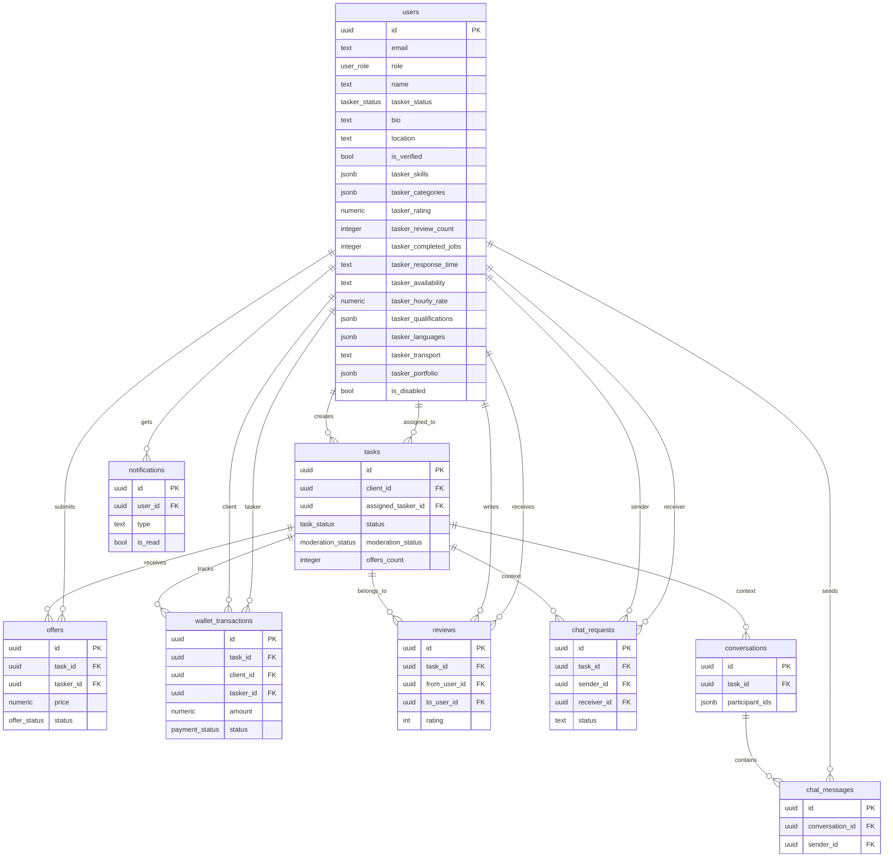

## Dopzy Database ERD

Last verified against live Supabase `public` schema on 2026-06-01.

```mermaid
erDiagram
  users ||--o{ tasks : creates
  users ||--o{ tasks : assigned_to

  tasks ||--o{ offers : receives
  users ||--o{ offers : submits

  tasks ||--o{ wallet_transactions : tracks
  users ||--o{ wallet_transactions : client
  users ||--o{ wallet_transactions : tasker

  tasks ||--o{ reviews : belongs_to
  users ||--o{ reviews : writes
  users ||--o{ reviews : receives

  users ||--o{ notifications : gets

  tasks ||--o{ chat_requests : context
  users ||--o{ chat_requests : sender
  users ||--o{ chat_requests : receiver

  tasks ||--o{ conversations : context
  conversations ||--o{ chat_messages : contains
  users ||--o{ chat_messages : sends

  users {
    uuid id PK
    text email
    user_role role
    text name
    tasker_status tasker_status
    text bio
    text location
    bool is_verified
    jsonb tasker_skills
    jsonb tasker_categories
    numeric tasker_rating
    integer tasker_review_count
    integer tasker_completed_jobs
    text tasker_response_time
    text tasker_availability
    numeric tasker_hourly_rate
    jsonb tasker_qualifications
    jsonb tasker_languages
    text tasker_transport
    jsonb tasker_portfolio
    bool is_disabled
  }

  tasks {
    uuid id PK
    uuid client_id FK
    uuid assigned_tasker_id FK
    task_status status
    moderation_status moderation_status
    integer offers_count
  }

  offers {
    uuid id PK
    uuid task_id FK
    uuid tasker_id FK
    numeric price
    offer_status status
  }

  wallet_transactions {
    uuid id PK
    uuid task_id FK
    uuid client_id FK
    uuid tasker_id FK
    numeric amount
    payment_status status
  }

  reviews {
    uuid id PK
    uuid task_id FK
    uuid from_user_id FK
    uuid to_user_id FK
    int rating
  }

  notifications {
    uuid id PK
    uuid user_id FK
    text type
    bool is_read
  }

  chat_requests {
    uuid id PK
    uuid task_id FK
    uuid sender_id FK
    uuid receiver_id FK
    text status
  }

  conversations {
    uuid id PK
    uuid task_id FK
    jsonb participant_ids
  }

  chat_messages {
    uuid id PK
    uuid conversation_id FK
    uuid sender_id FK
  }
```
